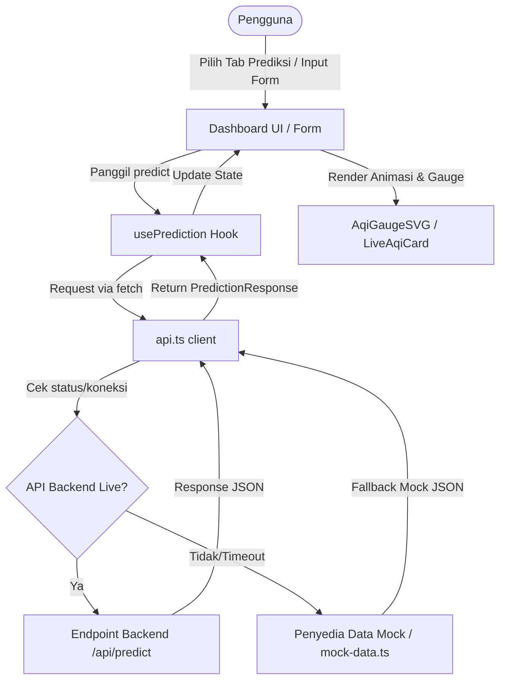

# Jakarta Air Quality Index (AQI) Predictor — Frontend

Aplikasi Web/Dashboard interaktif berbasis Next.js untuk memprediksi Indeks Kualitas Udara (Air Quality Index - AQI) di Jakarta berdasarkan faktor-faktor meteorologi (cuaca). Proyek ini merupakan bagian dari **Tugas Besar Artificial Intelligence (AI)** yang mengintegrasikan model Machine Learning dengan antarmuka pengguna (UI/UX) yang premium, adaptif, dan responsif.

---

## 🚀 Ikhtisar Proyek (Project Overview)

Aplikasi ini dirancang untuk memberikan informasi kualitas udara secara real-time dan prediktif bagi warga Jakarta. Dengan menggabungkan data cuaca historis dan real-time dari **Open-Meteo API** serta hasil komputasi model Machine Learning di backend (Scikit-Learn), aplikasi ini dapat meramalkan tingkat polusi udara (AQI) untuk esok hari, menyimulasikan berbagai skenario cuaca kustom, dan menelusuri data historis masa lampau.

---

## ✨ Fitur-Fitur Utama

1. **Dashboard Prediksi Dinamis**:
   - **Prediksi Besok (Auto Forecast)**: Mengambil otomatis metrik cuaca hari ini untuk menghitung prediksi AQI besok.
   - **Simulasi Kustom (Manual Input)**: Pengguna dapat menggeser slider metrik cuaca secara langsung untuk memproyeksikan skenario AQI tertentu. Dilengkapi dengan preset skenario siap-pakai: *Clean Breeze, Monsoon Rain, Severe Smog,* dan *Sunny & Dry*.
   - **Analisis Historis (Historical Prediction)**: Memilih tanggal di masa lalu untuk melihat metrik cuaca hari itu dan memprediksi AQI hari berikutnya.

2. **Visualisasi Data Premium**:
   - **Speedometer/Gauge Radial SVG**: Visualisasi level AQI interaktif dengan efek cahaya (glow) dinamis dan transisi mulus berbasis Framer Motion yang berubah warna sesuai dengan status kualitas udara.
   - **Grafik Tren 7 Hari (Recharts)**: Grafik komposit (Bar & Line) yang membandingkan AQI aktual dengan hasil prediksi model ML selama seminggu terakhir.

3. **Edukasi Kualitas Udara**:
   - **Info Metrik Interaktif**: Pop-up modal yang menjelaskan definisi, rumus ilmiah, dan korelasi masing-masing dari 9 faktor meteorologi terhadap polusi udara.
   - **Rekomendasi Kesehatan Dinamis**: Panduan aksi preventif (penggunaan masker, durasi aktivitas outdoor, penggunaan air purifier) berdasarkan tingkat keparahan AQI saat ini.

4. **Kenyamanan & Aksesibilitas (UX/UI)**:
   - **Dukungan Dua Bahasa (i18n)**: Dukungan penuh Bahasa Indonesia (`id`) dan Bahasa Inggris (`en`).
   - **Mode Gelap Adaptif (Dark Mode First)**: Tampilan premium bertema ekologis yang menyesuaikan dengan kenyamanan mata pengguna dan tersimpan dalam `localStorage`.
   - **Robust Auto-Fallback**: Sistem pertahanan tangguh yang mendeteksi matinya API backend, kemudian mengalihkan secara otomatis ke data mock simulasi yang realistis tanpa merusak jalannya aplikasi.

---

## 🛠️ Struktur Folder & Analisis Kode

Berikut adalah pemetaan struktur kode sumber aplikasi ini:

```
src/
├── app/                  # Entry point Next.js (App Router)
│   ├── globals.css       # Definisi variabel tema (Eco-Palette), glassmorphism, & animasi
│   ├── layout.tsx        # Layout utama & inisialisasi context provider
│   └── page.tsx          # Komponen halaman utama (Hero + Dashboard Grid)
├── components/           # Komponen UI modular
│   ├── animated/         # Komponen efek animasi (NumberTicker, ShimmerButton)
│   ├── dashboard/        # Komponen fungsional Dashboard AQI (Grafik, Form, Gauges)
│   ├── layout/           # Komponen struktur halaman (Navbar & Footer)
│   └── ui/               # Komponen UI dasar (Badge, Button, Input, Tabs)
├── hooks/                # Custom hooks React
│   ├── use-prediction.ts # Logic pemanggilan API backend, loading state, & error handling
│   └── use-theme.tsx     # Logic toggle & persistensi tema light/dark
├── i18n/                 # Kamus terjemahan lokal (Indonesian & English)
├── lib/                  # Utilitas dan helper fungsi
│   ├── api.ts            # Handler pemanggilan endpoint API & mekanisme fallback ke data mock
│   ├── aqi-utils.ts      # Klasifikasi level AQI, pemetaan warna, & styling Tailwind
│   └── mock-data.ts      # Penyedia data simulasi cuaca dan respons prediksi
└── types/                # Definisi tipe TypeScript untuk input cuaca dan output prediksi
```

### Analisis Aliran Data (Data Flow)


---

## 📊 9 Faktor Meteorologi & Dampaknya pada AQI

Aplikasi ini menggunakan 9 variabel masukan cuaca untuk memproyeksikan kualitas udara:

| Nama Variabel | Metrik di UI | Satuan | Deskripsi & Rumus Ilmiah | Korelasi Fisika & Kimia terhadap AQI |
| :--- | :--- | :---: | :--- | :--- |
| `aqi` | Baseline AQI | AQI | Konsentrasi polutan terukur saat ini (PM2.5, PM10, O3, dll.). | Berperan sebagai baseline polusi; nilai hari ini sangat mempengaruhi sisa polutan untuk esok hari. |
| `temperature_2m_mean` | Suhu Rata-rata | °C | Suhu udara rata-rata pada ketinggian 2 meter.<br>`T_mean = 1/24 * Sum(T_hourly)` | Suhu tinggi mempercepat reaksi fotokimia yang membentuk polutan sekunder seperti Ozon permukaan ($O_3$) dan smog. |
| `temperature_2m_min` | Suhu Minimum | °C | Suhu udara terendah sepanjang hari.<br>`T_min = Min(T_hourly)` | Suhu minimum yang sangat rendah pada malam hari memicu *Inversi Suhu*, yang memerangkap polutan dekat dengan tanah. |
| `precipitation_sum` | Curah Hujan | mm | Total curah hujan akumulatif dalam sehari.<br>`P_sum = Sum(P_hourly)` | Air hujan bertindak sebagai pembersih udara alami melalui proses *Wet Deposition*, menurunkan konsentrasi partikulat secara drastis. |
| `wind_speed_10m_mean` | Kecepatan Angin | km/h | Kecepatan angin rata-rata pada ketinggian 10 meter.<br>`WS_mean = 1/24 * Sum(WS_hourly)` | Angin kencang membantu proses *Dispersi* dan pengenceran polutan, sedangkan angin tenang (calm) menyebabkan polutan terakumulasi secara lokal. |
| `relative_humidity_2m_mean` | Kelembapan Relatif | % | Rasio uap air di udara dibanding kapasitas maksimumnya.<br>`RH_mean = 1/24 * Sum(RH_hourly)` | Kelembapan tinggi memfasilitasi reaksi kimia gas (seperti $SO_2$ dan $NO_2$) menjadi partikel sekunder PM2.5. |
| `surface_pressure_mean` | Tekanan Udara | hPa | Tekanan atmosfer rata-rata di permukaan bumi.<br>`P_mean = 1/24 * Sum(P_hourly)` | Sistem tekanan tinggi (*High-Pressure*) menciptakan kondisi atmosfer yang stabil (subsidence) sehingga polutan tidak bisa naik dan terdispersi. |
| `cloud_cover_mean` | Tutupan Awan | % | Persentase rata-rata langit yang tertutup awan.<br>`CC_mean = 1/24 * Sum(CC_hourly)` | Tutupan awan menghalangi radiasi matahari langsung, sehingga menghambat laju pembentukan ozon fotokimia. |
| `shortwave_radiation_sum` | Radiasi Matahari | MJ/m² | Jumlah energi radiasi gelombang pendek matahari.<br>`Rad_sum = Sum(Rad_hourly)` | Radiasi tinggi merupakan pendorong utama reaksi fotokimia polusi udara. |

---

## 💻 Cara Menjalankan Aplikasi

### 1. Prasyarat
Pastikan Anda telah menginstal **Node.js** (versi 18 ke atas) dan **npm** di sistem Anda.

### 2. Instalasi Dependensi
Jalankan perintah berikut di direktori utama proyek:
```bash
npm install
```

### 3. Konfigurasi Environment Variables
Buat file `.env.local` di root folder untuk mengarahkan API jika diperlukan:
```env
NEXT_PUBLIC_API_URL=http://localhost:8000
NEXT_PUBLIC_USE_MOCK=false # Set ke true untuk memaksa penggunaan data mock simulasi
```

### 4. Menjalankan Server Pengembangan
```bash
npm run dev
```
Buka [http://localhost:3000](http://localhost:3000) pada browser Anda untuk melihat hasilnya.

### 5. Menjalankan Unit Test
Untuk memastikan seluruh komponen dashboard lulus uji fungsionalitas:
```bash
npm test
```

---

## 🌟 Analisis Teknis Keunggulan Proyek
- **Arsitektur Modular**: Komponen UI dipisah secara mikro (seperti `aqi-gauge.tsx`, `health-tips.tsx`, `metric-card.tsx`), mempermudah pemeliharaan kode (*maintainability*).
- **Desain Adaptif**: Menggunakan Tailwind CSS v4 dengan variabel custom CSS terpusat, mendukung transisi tema yang sangat bersih dan performa rendering tinggi.
- **Resilience Design**: Fallback asinkron dengan visual delay buatan memberikan pengalaman pengguna yang konstan meskipun backend mengalami kegagalan sistem (*elegant degradation*).
